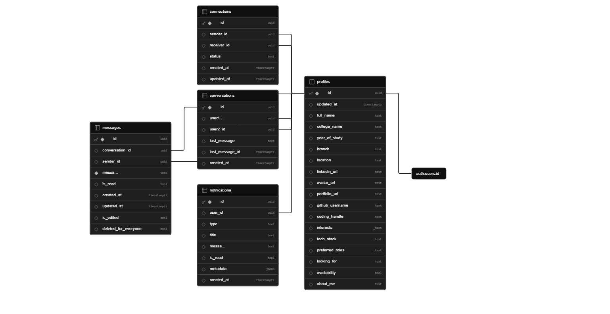

# YaarSpace
### Connect. Collaborate. Create.
Your next big project is one partner away. Find them on YaarSpace.


---

### 🔗 Live Demo
[**Live Link [coming soon]**](YOUR_LIVE_LINK_HERE) <br>
[**Video Link [coming soon]**](YOUR_LIVE_LINK_HERE)

## The Problem
In most colleges, a massive **communication gap** exists between talented individuals. Students often face these hurdles:

*   **Discovery Blindness:** You don't know who is interested in which tech stack within your own campus.
*   **No Dedicated Hub:** There is no central space to find partners; students rely on scattered WhatsApp groups or Discord servers.
*   **Privacy Barriers:** To collaborate, you usually need personal contact info (email/phone) before even knowing if you're a good match.
*   **Missed Opportunities:** Great ideas die because developers can't find designers, or AI enthusiasts can't find frontend experts nearby.

**YaarSpace** bridges this gap by bringing everyone under one unified, skill-based platform.

<br/>
<br/>

# The Solution
**YaarSpace** is a dedicated ecosystem designed to turn "I have an idea" into "We built it." We eliminate the friction of networking by providing:

*   **Smart Discovery:** Search and filter for teammates based on specific tech stacks, skills, or your specific college campus.
*   **Seamless Interaction:** Connect instantly through our integrated **real-time chat**, removing the need to share personal phone numbers or emails prematurely.
*   **Verified Credibility:** View consolidated **professional profiles** (GitHub, LinkedIn, Portfolio) in one click to verify skills and previous work before reaching out.
*   **Unified Collaboration:** A centralized hub where like-minded innovators can transition from strangers to a high-performing team in minutes.

### Key Features

*   **Smart Profile Cards:** Instantly view a user's tech stack, college, and professional links (GitHub/LinkedIn) at a glance through beautifully designed cards.
*   **Request-to-Chat Security:** Maintain your privacy with our **Connection Logic**. Strangers cannot message you until you explicitly accept their connection request.
*   **Real-Time Messaging:** Once connected, brainstorm and coordinate ideas through our seamless, low-latency chat interface.
*   **In-App Video Calling:** Skip the "Let's meet on Zoom" hassle. Start high-quality video calls directly within the platform to discuss project blueprints.
*   **Skill & Campus Filtering:** Find exactly who you need by filtering users by their specific technical expertise or university name.
*   **Discovery Feed:** Explore a curated list of like-minded individuals nearby or across the country who are actively looking for collaborators.

<br/>
<br/>

# 🛠️ Tech Stack

### Frontend
- ⚛️ React.js
- 🎨 Tailwind CSS
- 🧩 shadcn/ui
- 🎯 Lucide React Icons
- 🌐 Axios
- 🗂️ API Context (State Management)

### Backend
- 🟢 Node.js
- 🚀 Express.js
- 🔄 Socket.io
- 🌍 CORS

### Database & Backend Services
- 🐘 Supabase (PostgreSQL)
- 🔐 Supabase Authentication
- ☁️ Supabase Storage

<br/>
<br/>

# Architecture Overview
<!-- ## System Overview -->

The **YaarSpace** ecosystem is designed for high performance and secure real-time interaction. Below is the breakdown of how our core systems interact:

*   **Frontend (UI/UX):** Built with **React.js**, the client-side application delivers a responsive interface and communicates with the backend via structured **REST APIs** for data fetching and state management.
*   **Backend (Logic Layer):** Our **Node.js/Express** server acts as the central brain, handling:
    *   Authentication validation and session security.
    *   Connection management (the "Request-to-Chat" logic).
    *   System-wide notifications and business rules.
*   **Database & Storage (Powered by Supabase):**
    *   **PostgreSQL:** Handles relational data such as user profiles, campus directories, and message history.
    *   **Auth:** Manages secure sign-ups, logins, and JWT-based user sessions.
    *   **Storage:** Securely hosts user-generated content like profile pictures and media assets.
*   **Real-Time Engine:** **Socket.io** maintains a persistent websocket connection to ensure that messages and interaction alerts are delivered instantly without page refreshes.

## 🗄️ Database Design (High-Level)

YaarSpace uses **Supabase PostgreSQL** as the primary database for managing users, connections, conversations, and real-time collaboration data.

### Core Tables

| Table | Purpose |
|------|---------|
| `profiles` | Stores user information, tech stack, interests, social links, and profile data |
| `connections` | Manages connection requests and relationship status between users |
| `conversations` | Stores chat conversation metadata between connected users |
| `messages` | Stores real-time chat messages exchanged between users |
| `notifications` | Handles connection alerts, chat notifications, and system updates |

---

### Entity Relationship Overview

```text
profiles
   │
   ├── connections
   │       ├── sender_id
   │       └── receiver_id
   │
   ├── conversations
   │       ├── user1_id
   │       └── user2_id
   │
   └── messages
           ├── sender_id
           └── conversation_id

```


<br/>
<br/>

# ⚙️ Getting Started (Local Setup)

Follow these steps to set up YaarSpace locally on your machine.

---

### 1️⃣ Clone the Repository

```bash
git clone https://github.com/ranjan-mishra-dev/yaarspace.git
cd yaarspace
```

---

### 2️⃣ Install Dependencies

#### Frontend Setup

```bash
cd yaarspace-frontend
npm install
```

#### Backend Setup

```bash
cd yaarspace-backend
npm install
```

---

### 3️⃣ Configure Environment Variables [Checkout in next section(below)]
---

### 4️⃣ Start the Backend Server

```bash
node server.js
```

Backend will run on:

```text
http://localhost:5000
```

---

### 5️⃣ Start the Frontend

Open a new terminal and run:

```bash
cd yaarspace-frontend
npm run dev
```

Frontend will run on:

```text
http://localhost:5173
```

## Environment Variables

### Frontend Environment Variables

Create a `.env` file inside the `yaarspace-frontend` directory.

```env
VITE_SUPABASE_URL=your_supabase_url
VITE_SUPABASE_ANON_KEY=your_supabase_anon_key

VITE_API_URL=backend_url
```

---

### Backend Environment Variables

Create a `.env` file inside the `yaarspace-backend` directory.

```env
PORT=5000

SUPABASE_URL=your_supabase_url
SUPABASE_SERVICE_ROLE_KEY=your_service_role_key

CLIENT_URL=http://localhost:5173
```

---
<br/>

# 📡 API Overview

The backend follows a RESTful API architecture for handling search, connections, chat, and notifications.

Base URL:

```text
http://localhost:5000/api
```

---

### Search APIs

| Method | Endpoint | Description |
|--------|----------|-------------|
| GET | `/search` | Search users based on skills, interests, or college |

---

### Connection APIs

| Method | Endpoint | Description |
|--------|----------|-------------|
| POST | `/connections/send/:receiverId` | Send connection request |
| GET | `/connections/received` | Get received connection requests |
| GET | `/connections/sent` | Get sent connection requests |
| PATCH | `/connections/accept/:connectionId` | Accept connection request |
| PATCH | `/connections/reject/:connectionId` | Reject connection request |
| DELETE | `/connections/remove/:connectionId` | Remove sent connection request |

---

### Chat APIs

| Method | Endpoint | Description |
|--------|----------|-------------|
| GET | `/chat/conversations` | Get all conversations |
| GET | `/chat/messages/:conversationId` | Fetch messages of a conversation |
| POST | `/chat/messages/:conversationId` | Send message |
| PATCH | `/chat/messages/:conversationId/read` | Mark messages as read |
| PATCH | `/chat/messages/:messageId/edit` | Edit a message |
| DELETE | `/chat/messages/:messageId/everyone` | Delete message for everyone |

---

### Notification APIs

| Method | Endpoint | Description |
|--------|----------|-------------|
| GET | `/notifications` | Get all notifications |
| PATCH | `/notifications/:notificationId/read` | Mark notification as read |

---

### Test APIs

| Method | Endpoint | Description |
|--------|----------|-------------|
| GET | `/` | Check backend server status |
| GET | `/api/test` | Test API connection with frontend |

<br/>


# 📁 Folder Structure

The project is divided into two main applications:

- `yaarspace-frontend` → React frontend application
- `yaarspace-backend` → Node.js + Express backend server

---

### Frontend Structure

```text
yaarspace-frontend
│
├── public/                 # Static assets
├── src/
│   ├── api/                # API request handlers
│   ├── assets/             # Images, icons, and static resources
│   ├── components/         # Reusable UI components
│   ├── context/            # Global state & API context
│   ├── data/               # Static/local data
│   ├── lib/                # Utility libraries & configurations
│   ├── pages/              # Application pages/routes
│   ├── services/           # External service integrations
│   ├── utils/              # Helper utility functions
│   ├── App.jsx             # Main application component
│   ├── main.jsx            # React entry point
│   └── index.css           # Global styles
│
├── .env                    # Frontend environment variables
├── package.json            # Frontend dependencies & scripts
└── vite.config.js          # Vite configuration
```

---

### Backend Structure

```text
yaarspace-backend
│
├── src/
│   ├── config/             # Configuration files
│   ├── controllers/        # Business logic controllers
│   ├── db/                 # Database configuration & queries
│   ├── middlewares/        # Authentication & middleware logic
│   ├── routes/             # Express route handlers
│   ├── services/           # Service layer & reusable logic
│   └── app.js              # Express app configuration
│
├── .env                    # Backend environment variables
├── server.js               # Main server entry point
├── package.json            # Backend dependencies & scripts
└── package-lock.json       # Dependency lock file
```

The folder structure is designed to:  Maintain scalability and clean code organization. Separate business logic from routing logic.

<br/>
<br/>

# Future Work

We are constantly looking to evolve **YaarSpace** to better serve the student developer community. Upcoming features include:

*   **Integrated Video Calling:** Once a connection is established, users will be able to launch high-quality 1-on-1 video calls directly within the platform to discuss project blueprints face-to-face.

## 📜 License

This project is licensed under the MIT License. You are free to use, modify, and distribute this software in accordance with the license terms.


## Author

### Developed By

**Ranjan Mishra**  
Full Stack Developer passionate about building scalable SaaS products, real-time applications, and developer-focused platforms.

---

### 🌐 Connect With Me

- GitHub: https://github.com/ranjan-mishra-dev
- LinkedIn: https://linkedin.com/in/im-ranjan
- Leetcode: https://leetcode.com/u/ranjanmishra_lc

---

### Vision

YaarSpace aims to become a modern collaboration ecosystem where students and developers can easily discover talent, build meaningful connections, and create impactful projects together.